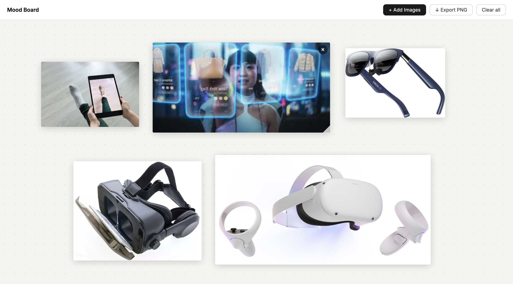

# Mood Board Maker

A free-form canvas for collecting and arranging images. Drag, resize, overlap — your layout saves automatically and exports as a PNG.

**[→ Live demo](https://gaspardberger.github.io/mood-board)**

## How to use

- **Add images** — click the button or drag files directly from your desktop onto the board
- **Move** — drag any image freely around the canvas
- **Resize** — hover a tile and drag the handle in the bottom-right corner
- **Remove** — hover a tile and click the × button
- **Export** — download the entire board as a PNG
- Your layout is saved automatically and restored when you reopen the page

## How it works

Each image is stored as a base64 string alongside its position and size in `localStorage`, so everything persists across sessions with no server needed. The export draws all tiles onto an HTML canvas at their exact coordinates and triggers a download.

## Built with

- Vanilla HTML, CSS & JavaScript — no libraries, no build tools
- [Canvas API](https://developer.mozilla.org/en-US/docs/Web/API/Canvas_API) — for image resizing and PNG export
- [localStorage](https://developer.mozilla.org/en-US/docs/Web/API/Window/localStorage) — for persistent layout saving

## Run locally

Open `index.html` in any browser. That's it.
